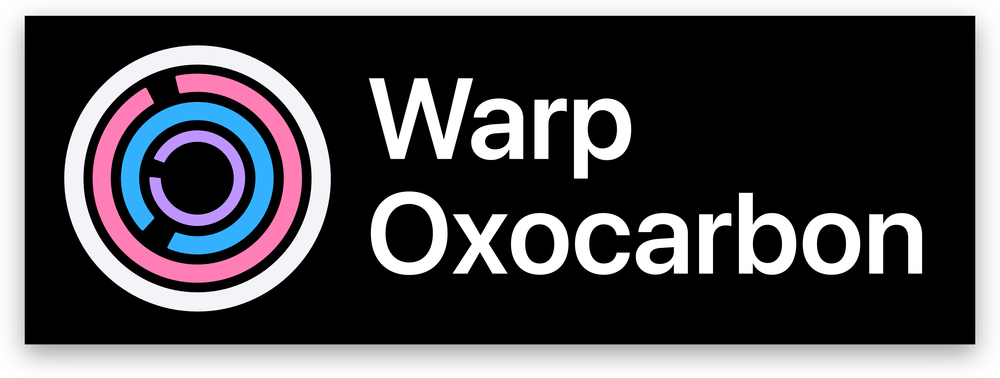

#  

<figure>
  
  <figcaption>Oxocarbon Dark</figcaption>
</figure>

<br>
<br>

<figure>
  
  <figcaption>Oxocarbon OLED</figcaption>
</figure>

<br>
<br>

Oxocarbon is a High contrast accessible colorscheme inspired by IBM Carbon. It delivers class-leading readability without strain by adhering to WCAG 2.1 guidelines.

## Features

- Comprehensive semantic highlighting
- Carefully crafted color palette for maximum contrast and readability
- Support for various terminal features

## Installation

### Warp Terminal

1. Create the themes directory if it doesn't exist:

```bash
mkdir -p ~/.warp/themes
```

2. Download themes to newly created directory

```bash
# default
curl -o ~/.warp/themes/oxocarbon.yaml https://raw.githubusercontent.com/nyoom-engineering/oxocarbon-warp/main/themes/oxocarbon.yaml
# oled
curl -o ~/.warp/themes/oxocarbon-oled.yaml https://raw.githubusercontent.com/nyoom-engineering/oxocarbon-warp/main/themes/oxocarbon-oled.yaml
```

3. Restart Warp and select the theme from Settings > Appearance > Theme

### Additional Configuration

It is recommended to install and set font to `Liga SFMono Nerd Font` 

## Development

The following requires `Cargo`/`Rust`. Changes should be made in `oxocarbon.toml`

To generate the Yaml files, run `make` in the root directory.

## Contributing

Before contributing, its recommended to read through the [style guide](https://github.com/nyoom-engineering/oxocarbon/blob/main/docs/style-guide.md). Discussion primarily takes place on the [Nyoom Engineering Discord Server](https://discord.gg/M528tDKXRG)

## License

The project is vendored under the MIT license
